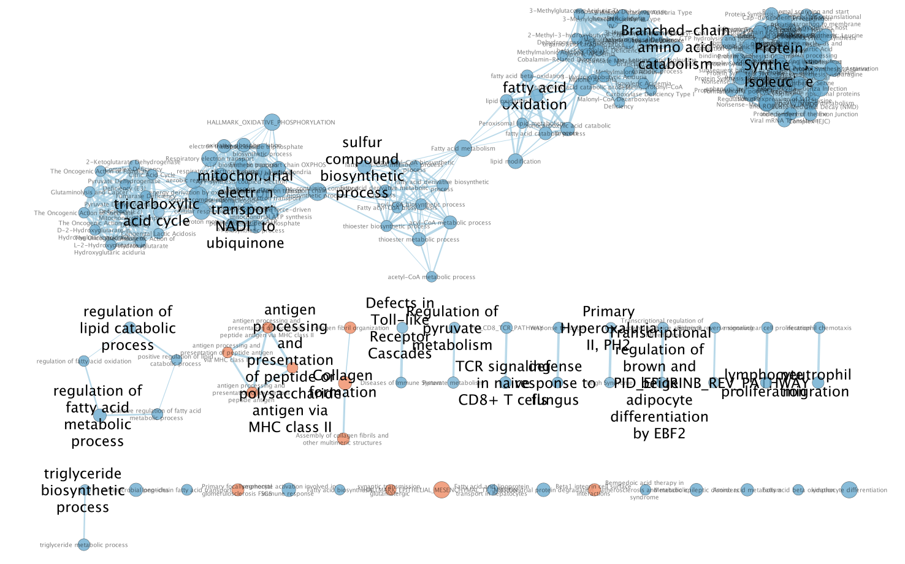
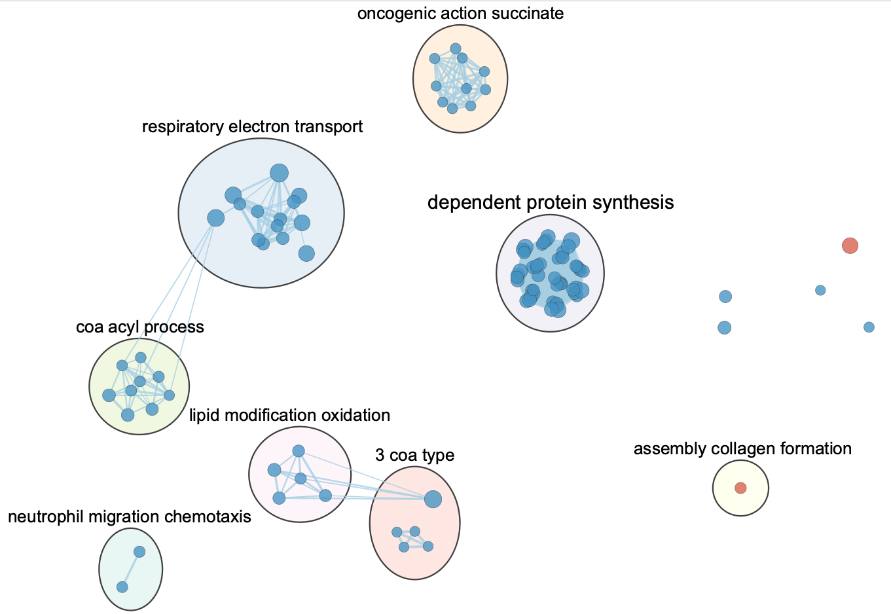

```{r setup, message=FALSE, warning=FALSE}
library(DESeq2)
library(tidyverse)
library(pheatmap)
library(ggplot2)
library(gprofiler2)
library(knitr)
library(kableExtra)
library(RCurl)
```
# Dataset and Preprocessing Summary
The data used in this study came from the RNA-seq dataset GSE104674 in the Gene Expression Omnibus (GEO) database [@GSE104674]. This dataset contains transcriptome data from subcutaneous adipose tissue and was designed to investigate gene expression differences between patients with type 2 diabetes and healthy controls. The raw dataset contains 48 samples obtained from 12 subjects, with four samples collected from each subject at different time points across the circadian cycle. The experimental group consists of obese individuals with type 2 diabetes, while the control group consists of healthy lean individuals.

In Assignment A1, the raw RNA-seq data were processed through several data cleaning and preprocessing steps. Raw count data were downloaded from GEO and combined with phenotype information to construct the sample grouping variable (control vs diabetes). Low-expression genes were filtered using the filterByExpr function from the edgeR package [@Robinson2010]. This filtering step removed 9029 genes with insufficient expression support across samples, reducing statistical noise and improving the reliability of downstream differential expression analysis.

The gene identifiers in the raw counts file were provided in the format gene_symbol:transcript_id. Because the analysis focused on gene-level expression rather than transcript-level expression, transcripts belonging to the same gene were merged by summing counts. Gene names were then validated using the biomaRt database [@Durinck2009] to confirm official HUGO gene symbols. Alias mapping was applied to recover gene symbols that appeared under alternative names, and genes that could not be mapped to official symbols were removed. After these steps, the final expression matrix contained 15,335 genes across 48 samples.

To correct for sequencing depth differences between samples, normalization was performed using the DESeq2 size factor normalization method [@Love2014]. The distribution of expression values was evaluated using density plots, boxplots, and multidimensional scaling (MDS) plots. These quality control plots showed that there were no major outliers among samples, and that normalization improved the comparability of expression distributions across samples. The MDS plot also showed a partial separation between diabetes and control samples, suggesting systematic transcriptional differences between the two groups.

Differential expression analysis in Assignment A1 was performed using the DESeq2 negative binomial model [@Love2014]. P-values were calculated using the Wald test and corrected for multiple hypothesis testing using the Benjamini–Hochberg false discovery rate procedure. Using adjusted p-value < 0.01 and |log2FoldChange| > 1 as significance thresholds, a total of 203 significantly differentially expressed genes were identified, including 92 upregulated genes and 111 downregulated genes. These differentially expressed genes were subsequently used as the input for functional enrichment analyses in Assignment 2, including over-representation analysis with g:Profiler and gene set enrichment analysis (GSEA).

This assignment focuses on identifying differentially expressed genes and performing functional enrichment analysis to identify biological processes associated with the observed transcriptional changes. We import the final data from Assignemnt 1.  
```{r}
load("A1_objects.RData")
```

# Differential Gene Expression

## Model Design

Differential expression analysis was conducted using the DESeq2 framework.

```{r}
design(dds)
```

The model tests whether gene expression differs between the diabetes and control groups.

## Differential Expression Testing {#def-res}

```{r}
res <- results(dds)

res_df <- as.data.frame(res) |>
  rownames_to_column("gene") |>
  drop_na(padj)
```

Genes were considered significantly differentially expressed using the following thresholds:

* adjusted p-value < 0.01
* absolute log2 fold change > 1

Adjusted p-values were calculated using the Benjamini–Hochberg false discovery rate correction. 111 Down regulated and 92 Up regulated genes are selected.

```{r}
res_df <- res_df |>
  mutate(
    sig = case_when(
      padj < 0.01 & log2FoldChange > 1 ~ "Up",
      padj < 0.01 & log2FoldChange < -1 ~ "Down",
      TRUE ~ "NS"
    )
  )

table(res_df$sig)
```

## Volcano Plot

```{r}
ggplot(res_df, aes(log2FoldChange, -log10(padj), color = sig)) +
  geom_point(alpha = 0.6) +
  scale_color_manual(values=c("blue","grey","red")) +
  theme_minimal() +
  labs(
    title="Volcano Plot of Differential Expression",
    x="log2 Fold Change",
    y="-log10 adjusted p-value"
  )
```  

**Figure 1**. Volcano plot of differentially expressed genes. This plot shows the expression changes of all genes obtained based on DESeq2 differential expression analysis. The horizontal axis is log2 Fold Change, representing the fold change in expression between the diabetes group and the control group; the vertical axis is −log10 (adjusted p-value), representing the significance of the difference. Each point represents a gene. Based on the threshold condition (adjusted p-value < 0.01 and |log2FoldChange| > 1), genes are divided into upregulated (red), downregulated (blue), and insignificant (gray). The volcano plot can visually display the distribution of differentially expressed genes in terms of statistical significance and expression change magnitude, and help identify candidate genes with large and significant changes.


## MA Plot

```{r}
ma_df <- as.data.frame(res)

ggplot(ma_df, aes(baseMean, log2FoldChange)) +
  geom_point(alpha=0.4, size=0.7) +
  scale_x_log10() +
  geom_hline(yintercept=0, color="red") +
  theme_minimal() +
  labs(
    x="Mean expression (log scale)",
    y="log2 fold change",
    title="MA Plot"
  )
```  

**Figure 2**. Differential expression analysis MA plot. This plot illustrates the relationship between average gene expression and expression change. The horizontal axis represents the mean expression (log scale) of genes across all samples, and the vertical axis represents log2 fold change. Each point represents a gene. The red horizontal line indicates a position where log2 fold change = 0, meaning there is no difference in expression between the two groups. This plot can be used to assess the overall stability of differential expression analysis and the impact of expression level on fold change. Most genes are concentrated in the region where log2 fold change is close to 0, indicating that most genes show little difference in expression between the two groups, while only a few genes show significant upregulation or downregulation.


## Heatmap of Top Differentially Expressed Genes

```{r}
deg_genes <- res_df |>
  filter(sig != "NS") |>
  pull(gene)

heatmap_mat <- norm_counts[deg_genes, ]

heatmap_mat_scaled <- t(scale(t(heatmap_mat)))
annotation_col <- data.frame(
  group = colData(dds)$group
)

rownames(annotation_col) <- colnames(norm_counts)
breaks <- seq(-3, 3, length.out = 101)

pheatmap(
  heatmap_mat_scaled,
  show_rownames = FALSE,
  cluster_rows = TRUE,
  cluster_cols = FALSE,
  annotation_col = annotation_col,
  gaps_col = sum(annotation_col$group == "control"),
  border_color = NA,
  color = colorRampPalette(c("blue","white","red"))(100),
  breaks = breaks,
  main = "Heatmap of Differentially Expressed Genes"
)
```  

**Figure 3**. Heatmap of differentially expressed genes. This figure shows the expression patterns of significantly differentially expressed genes identified in the differential expression analysis across all samples. Rows represent genes, and columns represent samples. Expression values ​​were standardized (row scaling) before plotting to highlight differences in expression patterns between samples. Colors from blue to red represent low and high expression levels, respectively. The annotation bar at the top indicates the group to which the sample belongs (control vs. diabetes). Hierarchical clustering reveals that some genes are generally upregulated in diabetes samples and expressed at lower levels in control samples, and vice versa, suggesting that these genes may be involved in disease-related biological processes.


# Thresholded Over-Representation Analysis

## Ranking
```{r}
ranked_genes <- res_df |>
  arrange(desc(log2FoldChange))
gene_rank_vector <- ranked_genes$log2FoldChange
names(gene_rank_vector) <- ranked_genes$gene
ggplot(ranked_genes, aes(log2FoldChange)) +
  geom_histogram(bins=100, fill="steelblue", color="black") +
  theme_minimal() +
  labs(
    title="Distribution of Differential Expression",
    x="log2 Fold Change",
    y="Gene Count"
  )
```  

**Figure 4**. Distribution of ranked differential expression. This figure shows the distribution of log2 Fold Change for all genes. The horizontal axis represents log2 Fold Change, and the vertical axis represents the number of genes. This distribution is used to observe the overall trend of differential expression changes and serves as the basis for constructing the gene ranking list in GSEA analysis. It can be seen that the expression changes of most genes are concentrated around 0, indicating relatively small overall expression changes, while only a few genes show large expression changes.  

# G:profiler  
## Run Analysis
We have obtained three gene sets based on the DESeq2 results: upregulated genes, downregulated genes, and all differentially expressed genes. Next, we will use g:Profiler to perform over-representation analysis on these gene sets to identify significantly enriched biological processes and pathways. The input gene were got from Defferential Expression Test (see [result](#def-res)), 111 Down gene and 92 Up gene were used in analysis. The annotation database used included Gene Ontology (Biological Process, Cellular Component, Molecular Function), KEGG, Reactome and CORUM pathways.  
The analysis was performed for Homo sapiens (hsapiens) using the current annotation release provided by g:Profiler at the time of analysis [@Raudvere2019]. First, we will perform enrichment analysis on upregulated and downregulated genes separately. g:Profiler will calculate significance based on the frequency of the input gene set in each functional category using a hypergeometric test and perform multiple validation correction. 
```{r}
res_df <- res_df |>
  mutate(
    sig = case_when(
      padj < 0.01 & log2FoldChange > 1 ~ "Up",
      padj < 0.01 & log2FoldChange < -1 ~ "Down",
      TRUE ~ "NS"
    )
  )
# extract gene lists for enrichment analysis
up_genes <- res_df |>
  filter(sig == "Up") |>
  pull(gene)

down_genes <- res_df |>
  filter(sig == "Down") |>
  pull(gene)

all_genes <- res_df |>
  filter(sig != "NS") |>
  pull(gene)

gost_up <- gost(
  query = up_genes,
  organism = "hsapiens",
  correction_method = "fdr"
)

gost_down <- gost(
  query = down_genes,
  organism = "hsapiens",
  correction_method = "fdr"
)

gost_all <- gost(
  query = all_genes,
  organism = "hsapiens",
  correction_method = "fdr"
)
```  

## Results
From the G:profiler results, we used a corrected FDR of less than 0.05 as a threshold to filter statistically significant functional categories. We then examined how many significantly enriched functional categories were returned in each analysis.

```{r}
# Extract result tables 
res_up <- gost_up$result
res_down <- gost_down$result
res_all <- gost_all$result

# Filter significant enriched terms
sig_up <- res_up |> filter(p_value < 0.05)
sig_down <- res_down |> filter(p_value < 0.05)
sig_all <- res_all |> filter(p_value < 0.05)
up_df <- gost_up$result |> mutate(direction = "Up")
down_df <- gost_down$result |> mutate(direction = "Down")

combined_df <- bind_rows(up_df, down_df)
table_df <- combined_df |>
  mutate(logFDR = -log10(p_value)) |>
  filter(p_value < 0.05) |>
  group_by(direction) |>
  arrange(p_value) |>
  slice_head(n = 5) |>
  ungroup() |>
  dplyr::select(
    Database = source,
    Term = term_name,
    log10FDR = logFDR,
    GeneCount = intersection_size,
    Direction = direction
  )

knitr::kable(table_df, digits = 3) |>
  kable_styling(
    full_width = FALSE,
    bootstrap_options = c("striped", "hover")
  )
```
  
**Table 1**. Results of g:Profiler functional enrichment analysis of differentially expressed genes. The top 5 categories with the highest enrichment significance for both UP and Down were selected. Database indicates the source of the functional annotation database (e.g., different classifications of GO); Term indicates the specific biological function or pathway name enriched; log10FDR is the −log10(FDR) value of enrichment significance, with a larger value indicating higher significance; GeneCount indicates the number of genes in the input gene set that fall into this functional pathway; Direction indicates the gene direction from which the enrichment originates, where Up indicates upregulated gene enrichment and Down indicates downregulated gene enrichment.


## Manhattan Plot 
G:profiler includes a Manhattan plot. The Manhattan plot allows us to see details of gene enrichment in significant functional categories.  

```{r}
up_df <- gost_up$result |> mutate(direction = "Up")
down_df <- gost_down$result |> mutate(direction = "Down")
combined_df <- bind_rows(up_df, down_df)

combined_df <- combined_df |>
  mutate(
    logFDR = -log10(p_value),
    category = case_when(
      p_value < 0.05 & direction == "Up" ~ "Up",
      p_value < 0.05 & direction == "Down" ~ "Down",
      TRUE ~ "Not significant"
    ),
    source = factor(source)
  )

bg_df <- combined_df |>
  distinct(source) |>
  arrange(source) |>
  mutate(
    xmin = as.numeric(source) - 0.5,
    xmax = as.numeric(source) + 0.5,
    ymin = -Inf,
    ymax = Inf,
    bg = source
  )

ggplot(combined_df, aes(x = source, y = logFDR, color = category)) +
  geom_rect(
    data = bg_df,
    aes(xmin = xmin, xmax = xmax, ymin = ymin, ymax = ymax, fill = bg),
    inherit.aes = FALSE,
    alpha = 0.3
  ) +
  geom_jitter(width = 0.25, size = 2, alpha = 0.9) +
  scale_color_manual(values = c(
    "Up" = "#A90C38",
    "Down" = "#2E5A87",
    "Not significant" = "black"
  )) +
  scale_fill_brewer(palette = "Set3", guide = "none") +
  geom_hline(yintercept = -log10(0.05), linetype = "dashed") +
  theme_minimal() +
  labs(
    title = "Manhattan Plot of Functional Enrichment",
    x = "Annotation database",
    y = "-log10(FDR)",
    color = "Category"
  )
```
  
**Figure 5**. g: Profiler Functional Enrichment Manhattan Plot. This plot shows the results of over-representation analysis (ORA) based on differentially expressed genes. The horizontal axis represents different functional annotation databases, including CORUM, GO Biological Process, GO Cellular Component, GO Molecular Function, KEGG, and Reactome; the vertical axis is −log10 (FDR), representing enrichment significance. Each point represents an enriched pathway. Red dots indicate enriched pathways driven by upregulated genes, and blue dots indicate enriched pathways driven by downregulated genes. The dashed line represents the significance threshold (FDR = 0.05). This plot is used to provide an overall view of the distribution of significantly enriched pathways across different functional databases and helps identify important biological processes that recur in multiple databases.  

## Interpretation
We can see that downregulated genes are significantly enriched in BP, CORUM, and CORUM, while upregulated genes are significantly enriched in BP, CC, and MF. Stenvers' paper mentions that classical metabolic pathways related to lipolysis regulation have lost their diurnal rhythm, and the activity of the translation initiation-related pathway "EIF2 signaling" is reduced [@GSE104674]. This corresponds to the large number of downregulated genes we see in the Biology process, which is likely related to the EIF2 pathway. Meanwhile, Yu's paper, in its differential expression analysis in diabetes, also found upregulated genes enriched in enzyme activity, binding activity, and mitochondrial components, corresponding to the CC and MF classes in my results [@Yu2025]. Gabrie's study shows Type II diabetes will effect mitochonfrial metabolism in skeletal muscle [@Gabriel2021]. This demonstrates that diabetes may affects pathways such as mitochondrial composition and energy metabolism.  

# GSEA  
Gene set enrichment analysis (GSEA) was performed using the GSEA Preranked algorithm implemented in the Broad Institute GSEA software (version 4.4.0) [@Subramanian2005]. In this approach, genes were ranked according to the log2 fold change obtained from the DESeq2 differential expression analysis, and enrichment was evaluated using a weighted Kolmogorov–Smirnov–like statistic. The analysis was run with 1000 permutations and gene set sizes between 15 and 200.

For pathway annotation, gene sets were obtained from the Bader Lab gene set collection, specifically the file *GOBP_AllPathways_noPFOCR_no_GO_iea*, which integrates Gene Ontology Biological Process, Reactome, and other curated pathway databases. The annotation file was downloaded from the Bader Lab repository (September 2025 release) and uses human gene symbols as identifiers.
  
## Get Reference
```{r}
tryCatch(expr = { library("RCurl")}, 
         error = function(e) {  
           install.packages("RCurl")}, 
         finally = library("RCurl"))

# GSEA jar
gsea_jar <- params$gsea_jar
working_dir <- params$working_dir
output_dir <- params$output_dir
analysis_name <- params$analysis_name
rnk_file <- params$rnk_file
run_gsea <- params$run_gsea

dest_gmt_file <- ""
if(dest_gmt_file == ""){
  gmt_url = "https://download.baderlab.org/EM_Genesets/September_01_2025/Human/symbol/"
  
  filenames = getURL(gmt_url)
  tc = textConnection(filenames)
  contents = readLines(tc)
  close(tc)
  
  rx = gregexpr("(?<=<a href=\")(.*.GOBP_AllPathways_noPFOCR_no_GO_iea.*.)(.gmt)(?=\">)",
    contents, perl = TRUE)
  gmt_file = unlist(regmatches(contents, rx))
  
  dest_gmt_file <- file.path(output_dir,gmt_file )
  
  if(!file.exists(dest_gmt_file)){
    download.file(
      paste(gmt_url,gmt_file,sep=""),
      destfile=dest_gmt_file
    )
  }
}
```
## Run analysis
```{r, results='hide'}

rank_df <- data.frame(
  gene = names(gene_rank_vector),
  score = gene_rank_vector
)

write.table(
  rank_df,
  file = file.path(working_dir, rnk_file),
  sep = "\t",
  quote = FALSE,
  row.names = FALSE,
  col.names = FALSE
)
command <- paste(
  gsea_jar,
  "GSEAPreRanked",
  "-gmx", dest_gmt_file,
  "-rnk", file.path(working_dir, rnk_file),
  "-collapse false",
  "-nperm 1000",
  "-scoring_scheme weighted",
  "-rpt_label", analysis_name,
  "-plot_top_x 20",
  "-rnd_seed 12345",
  "-set_max 200",
  "-set_min 15",
  "-zip_report false",
  "-out", output_dir
)

system(command)

```

## Results
```{r}

pos_file <- list.files(
  output_dir,
  pattern = "gsea_report_for_na_pos.*\\.tsv$",
  full.names = TRUE,
  recursive = TRUE
)

neg_file <- list.files(
  output_dir,
  pattern = "gsea_report_for_na_neg.*\\.tsv$",
  full.names = TRUE,
  recursive = TRUE
)

gsea_up <- read_tsv(pos_file[1])
gsea_down <- read_tsv(neg_file[1])

gsea_up$direction <- "Up"
gsea_down$direction <- "Down"

gsea_res <- bind_rows(gsea_up, gsea_down)

gsea_sig <- gsea_res |>
  filter(`FDR q-val` < 0.05) |>
  mutate(
    Pathway = str_replace(NAME, "%.*", "")
  )

top_up <- gsea_sig |>
  filter(direction == "Up") |>
  arrange(desc(NES)) |>
  slice_head(n = 10) |>
  pull(Pathway)

top_down <- gsea_sig |>
  filter(direction == "Down") |>
  arrange(NES) |>
  slice_head(n = 10) |>
  pull(Pathway)

table_df <- tibble(
  Down = top_down,
  Up = top_up
)

table_df |>
  kable(
    caption = "Top Enriched Pathways from GSEA",
    col.names = c("Downregulated pathways", "Upregulated pathways"),
    booktabs = TRUE
  ) |>
  kable_styling(full_width = FALSE) |>
  column_spec(1, width = "6cm") |>
  column_spec(2, width = "6cm")
```  

**Table 2.** Significantly enriched pathways obtained from GSEA analysis, selecting the top 10 downregulated and upregulated pathways. The left column shows pathways with significantly downregulated genes, and the right column shows pathways with significantly upregulated genes. Each row displays the name of the functional pathway significantly enriched in the ranking analysis. Downregulated pathways are mainly concentrated in protein synthesis and translation-related processes, while upregulated pathways mainly involve biological processes such as extracellular matrix organization, immune responses, and cell-cell interactions.  

## Interpretations  
The GSEA results are generally consistent with previous g:Profiler enrichment analyses. g:Profiler analysis showed that downregulated genes were mainly enriched in Biological Process (BP) and CORUM complex-related pathways, while upregulated genes were more enriched in the BP, Cellular Component (CC), and Molecular Function (MF) categories, indicating that in diabetic states, genes in different functional modules exhibit regulatory changes in different directions. In the GSEA analysis, downregulated pathways were mainly related to protein synthesis and translation processes, such as protein synthesis pathways related to various amino acids and eukaryotic translation elongation. This result is consistent with the enrichment of downregulated genes in the BP category in g:Profiler. Previous studies have shown that circadian rhythm-regulated metabolic pathways are disrupted in the adipose tissue of patients with type 2 diabetes, while the activity of translation-related pathways (such as EIF2 signaling) is decreased, thereby affecting protein synthesis and metabolic regulation [@GSE104674]. In contrast, the upregulated pathways in GSEA are mainly involved in immune responses and intercellular interactions, such as antigen processing and presentation. This result also corresponds to the enrichment of upregulated genes in the CC and MF categories in g:Profiler. Previous studies have found that in transcriptomic analysis of diabetes, upregulated genes are often enriched in enzyme activity, molecular binding, and mitochondrial-related functional categories [@Yu2025]. Furthermore, studies have shown that type 2 diabetes affects mitochondrial energy metabolism in metabolic tissues [@Gabriel2021].   
# Cytoscape

## Generate network
First, the GSEA results were visualized using the Cytoscape EnrichmentMap plugin. Input files included the GSEA-generated `gsea_report_for_na_pos` and `gsea_report_for_na_neg` result files, and the gene set database `.gmt` file used for analysis. The main thresholds used in network construction were: FDR q-value < 0.05, p-value < 0.01, gene set similarity using the overlap coefficient, and a similarity cutoff of 0.375. An enrichment network was generated based on these parameters, where each node represents an enriched pathway, and edges between nodes indicate shared genes between two pathways.  
```{r}

```
  
**Figure 6**. GSEA Enrichment Pathway Network (Original EnrichmentMap). This figure shows the enrichment pathway network constructed in Cytoscape based on GSEA (Gene Set Enrichment Analysis) results. Each node represents a significantly enriched pathway, and the lines between nodes indicate shared genes between two pathways. Node color indicates the direction of pathway enrichment (upregulation or downregulation), and node size is related to the enrichment intensity. This figure shows the original network structure before layout adjustments and clustering. Due to the large number of enriched pathways, the network is relatively dense, and many pathways form complex connections through shared genes.  

I set the FDR threshold to 0.005 and the similarity cutoff to 0.5. I selected the more prominent nodes and edges to display. I hid the labels of individual nodes, only showing the labels of clusters, and distinguished them by different colors. Finally, I reformatted the layout, generating the following image.  
```{r}

```
  
**Figure 7**. GSEA Enrichment Pathway Theme Network (Enrichment Map after AutoAnnotate Clustering). This figure shows the results of clustering and topic labeling the enriched pathway network using the AutoAnnotate plugin in Cytoscape. Pathways with similar gene overlap were automatically grouped into clusters, and topic labels were generated based on keywords in the pathway names. Each cluster represents a group of pathways with similar biological functions, such as protein synthesis, respiratory electron transport, fatty acid oxidation, lipid metabolism regulation, and immune-related processes (such as neutrophil migration). This network structure can integrate a large number of individual enriched pathways into several main functional modules, making it easier to identify important biological processes that undergo synergistic changes in the data.

# Discussion  
This study systematically analyzed the functions of differentially expressed genes using g:Profiler, GSEA, and Cytoscape network analysis. The results from the three methods were generally consistent, indicating that multiple metabolic pathways are significantly altered in type 2 diabetes.

First, in g:Profiler analysis, downregulated genes were mainly enriched in Biological Process (BP) and CORUM complex-related pathways, while upregulated genes were more enriched in Cellular Component (CC) and Molecular Function (MF) categories. GSEA analysis further showed that downregulated pathways were mainly concentrated in protein synthesis and translation-related processes, such as multiple protein synthesis pathways and eukaryotic translation elongation. This is consistent with previous research. Studies have shown that in adipose tissue of patients with type 2 diabetes, the activity of translation-related pathways (such as EIF2 signaling) is reduced, thereby affecting protein synthesis and metabolic regulation [@Stenvers2019].

Second, in the Cytoscape EnrichmentMap network, lipid metabolism-related pathways formed distinct modules, such as "coa acyl process" and "lipid modification oxidation." Abnormal lipid metabolism is a key characteristic of type 2 diabetes. Studies have shown that in a state of insulin resistance, the expression of genes related to fatty acid metabolism and lipid oxidation is altered, thereby affecting energy metabolism and insulin signaling pathways [@Soronen2012; @Samuel2016].

Furthermore, immune-related pathways, such as the neutrophil migration chemotaxis, are also present in the network. Recent studies have found that type 2 diabetes is often accompanied by a chronic low-grade inflammatory response, and immune cell infiltration and activation of inflammatory signaling pathways in adipose tissue promote the development of insulin resistance [@Hotamisligil2017].

Overall, the enrichment analysis results of this study indicate that protein translation is suppressed in type 2 diabetes-related adipose tissue, while lipid metabolism and immune-inflammatory pathways are activated. These changes collectively reflect metabolic disorders and inflammatory responses in diabetes.

# Reference