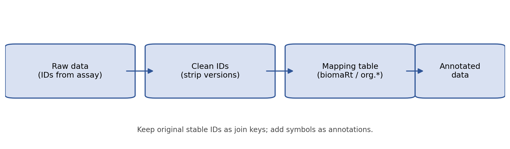

# What is identifier mapping?

Identifier mapping is translating between different ways of naming the same biological entity.

Common situations:

- Data uses stable IDs (e.g., **Ensembl gene IDs**)
- Downstream tools want gene symbols (e.g., **HGNC**)
- Some assays use non-gene identifiers (probes, peptides, genomic coordinates)

## Visual overview

