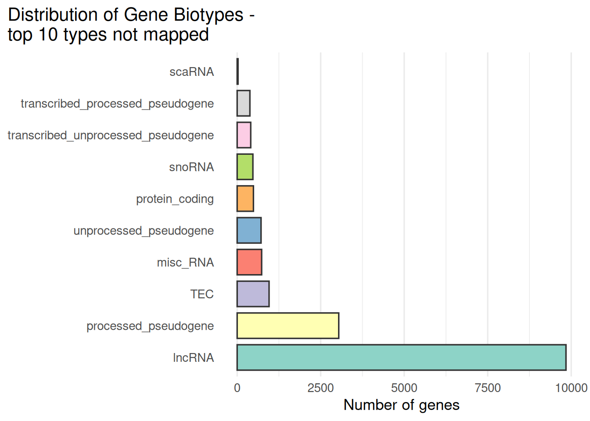

# Worked examples with before/after tables

This chapter shows **what the data look like**, **what the IDs look like**, and **how the table changes once mapped**.


``` r
library(knitr)
library(dplyr)
```

```
## 
## Attaching package: 'dplyr'
```

```
## The following objects are masked from 'package:stats':
## 
##     filter, lag
```

```
## The following objects are masked from 'package:base':
## 
##     intersect, setdiff, setequal, union
```

``` r
library(tibble)

kable_head <- function(x, n = 5, caption = NULL) {
  knitr::kable(utils::head(x, n), caption = caption)
}

strip_ensembl_version <- function(x) sub("\\..*$", "", x)
```


## GSE233947

### Raw data preview


``` r
source("./fetch_geo_supp.R")
fetch_geo_supp(gse = params$gse)
```

```
## Setting options('download.file.method.GEOquery'='auto')
```

```
## Setting options('GEOquery.inmemory.gpl'=FALSE)
```

```
## Using locally cached version of supplementary file(s) GSE233947 found here:
## data/GSE233947/GSE233947_FeatureCounts_V31genes_RawCounts_ENSG.tsv.gz
```

```
## Using locally cached version of supplementary file(s) GSE233947 found here:
## data/GSE233947/GSE233947_modulize_3CTG_20CTG_junctions.tsv.gz
```

```
## Using locally cached version of supplementary file(s) GSE233947 found here:
## data/GSE233947/GSE233947_modulize_NT_20CTG_junctions.tsv.gz
```

```
## Using locally cached version of supplementary file(s) GSE233947 found here:
## data/GSE233947/GSE233947_modulize_NT_3CTG_junctions.tsv.gz
```

``` r
path <- file.path("data", params$gse)
files <- list.files(path, pattern = params$file_grep, 
                    full.names = TRUE, recursive = TRUE)

kable_head(tibble(file = basename(files)), min(10, length(files)), paste(params$gse,": extracted file list (first 10)"))
```


Table: (\#tab:get_data)GSE233947 : extracted file list (first 10)

|file                                                   |
|:------------------------------------------------------|
|GSE233947_FeatureCounts_V31genes_RawCounts_ENSG.tsv.gz |
|GSE233947_modulize_3CTG_20CTG_junctions.tsv.gz         |
|GSE233947_modulize_NT_20CTG_junctions.tsv.gz           |
|GSE233947_modulize_NT_3CTG_junctions.tsv.gz            |

Raw table preview


``` r
library(readr)

safe_read <- function(file) {
  # First attempt: read as TSV
  df <- tryCatch(
    readr::read_tsv(file, show_col_types = FALSE),
    error = function(e) NULL   # catch fatal errors
  )
  
  # If read_tsv failed entirely:
  if (is.null(df)) {
    message("TSV read failed — reading as space-delimited file instead.")
    return(readr::read_table(file, show_col_types = FALSE))
  }
  
  # If read_tsv returned but with parsing issues:
  probs <- problems(df)
  if (nrow(probs) > 0) {
    message("Parsing issues detected in TSV — reading as space-delimited file instead.")
    return(readr::read_table(file, show_col_types = FALSE))
  }
  
  # If everything was fine:
  return(df)
}

x <- safe_read(files[1])


kable_head(x[, 1:min(6, ncol(x))], 5, paste(params$gse,": raw table preview"))
```


Table: (\#tab:preview_raw)GSE233947 : raw table preview

|Gene            | T8657_900CTG_NT| T8658_1150CTG_NT| T8659_1450CTG_NT| T8660_900CTG_20CTG| T8661_1150CTG_20CTG|
|:---------------|---------------:|----------------:|----------------:|------------------:|-------------------:|
|ENSG00000108821 |          456397|           486088|           608151|            2012962|              379186|
|ENSG00000265150 |          170681|           299425|           286295|             747000|              210962|
|ENSG00000164692 |          169781|           190854|           263391|             869194|              180006|
|ENSG00000265735 |           78113|           121697|           113379|             532435|              112977|
|ENSG00000259001 |           55081|            78811|            73032|             353442|              100823|

ID preview


``` r
id_col <- names(x)[1]
ids <- x[[1]] |> as.character()
kable_head(tibble(raw_id = head(ids, 10), 
                  stripped = strip_ensembl_version(head(ids, 10))), 
           10, paste(params$gse,": ID preview"))
```


Table: (\#tab:id_preview)GSE233947 : ID preview

|raw_id          |stripped        |
|:---------------|:---------------|
|ENSG00000108821 |ENSG00000108821 |
|ENSG00000265150 |ENSG00000265150 |
|ENSG00000164692 |ENSG00000164692 |
|ENSG00000265735 |ENSG00000265735 |
|ENSG00000259001 |ENSG00000259001 |
|ENSG00000163359 |ENSG00000163359 |
|ENSG00000115414 |ENSG00000115414 |
|ENSG00000168542 |ENSG00000168542 |
|ENSG00000251562 |ENSG00000251562 |
|ENSG00000155657 |ENSG00000155657 |


### After mapping (Ensembl → HGNC)


``` r
if (any(grepl("^ENSG", strip_ensembl_version(ids)))) {
  library(biomaRt)
  ensembl_ids <- unique(strip_ensembl_version(ids))
  ensembl <- useMart("ensembl", dataset = "hsapiens_gene_ensembl")

  map <- getBM(
    attributes = c("ensembl_gene_id", "hgnc_symbol"),
    filters = "ensembl_gene_id",
    values = ensembl_ids,
    mart = ensembl
  )

  kable_head(map, 10, paste(params$gse,": mapping preview"))

  expr_mapped <- x %>%
    mutate(ensembl_gene_id = strip_ensembl_version(.data[[id_col]])) %>%
    left_join(map, by = "ensembl_gene_id") %>%
  dplyr::select( ensembl_gene_id,hgnc_symbol, everything())


  kable_head(expr_mapped[, 1:min(8, ncol(expr_mapped))], 5, paste(params$gse,": mapped table preview"))
}
```


Table: (\#tab:after_map)GSE233947 : mapped table preview

|ensembl_gene_id |hgnc_symbol |Gene            | T8657_900CTG_NT| T8658_1150CTG_NT| T8659_1450CTG_NT| T8660_900CTG_20CTG| T8661_1150CTG_20CTG|
|:---------------|:-----------|:---------------|---------------:|----------------:|----------------:|------------------:|-------------------:|
|ENSG00000108821 |COL1A1      |ENSG00000108821 |          456397|           486088|           608151|            2012962|              379186|
|ENSG00000265150 |NA          |ENSG00000265150 |          170681|           299425|           286295|             747000|              210962|
|ENSG00000164692 |COL1A2      |ENSG00000164692 |          169781|           190854|           263391|             869194|              180006|
|ENSG00000265735 |RN7SL5P     |ENSG00000265735 |           78113|           121697|           113379|             532435|              112977|
|ENSG00000259001 |            |ENSG00000259001 |           55081|            78811|            73032|             353442|              100823|

Summarize the mapping


``` r
n_ensembl_total <- expr_mapped %>%
  distinct(ensembl_gene_id) %>%
  nrow()

n_mapped <- expr_mapped %>%
  filter(!is.na(hgnc_symbol), hgnc_symbol != "") %>%
  distinct(ensembl_gene_id) %>%
  nrow()

n_unmapped <- n_ensembl_total - n_mapped

mapping_summary <- tibble::tibble(
  category = c("Total Ensembl IDs", "Mapped to HGNC", "Unmapped"),
  n = c(n_ensembl_total, n_mapped, n_unmapped)
)

mapping_summary
```

```
## # A tibble: 3 × 2
##   category              n
##   <chr>             <int>
## 1 Total Ensembl IDs 62248
## 2 Mapped to HGNC    40176
## 3 Unmapped          22072
```


``` r
unmapped_ids <- expr_mapped %>%
  distinct(ensembl_gene_id, hgnc_symbol) %>%
  filter(is.na(hgnc_symbol) | hgnc_symbol == "") %>%
  pull(ensembl_gene_id) %>%
  unique()

length(unmapped_ids)
```

```
## [1] 22072
```


``` r
library(stringr)

unmapped_classified <- tibble::tibble(id = unmapped_ids) %>%
  mutate(type = case_when(
    str_detect(id, "^ENSG\\d+$") ~ "Ensembl gene ID (ENSG)",
    str_detect(id, "^ENSG\\d+\\.\\d+$") ~ "Ensembl gene ID with version (ENSG.x) — needs stripping",
    str_detect(id, "^ENST\\d+") ~ "Ensembl transcript ID (ENST) — wrong target for gene mapping",
    str_detect(id, "^ENSP\\d+") ~ "Ensembl protein ID (ENSP) — wrong target",
    str_detect(id, "^ENS.*G\\d+") ~ "Non-human Ensembl gene (e.g., ENSMUSG...) — wrong organism",
    str_detect(id, "^ERCC-") ~ "ERCC spike-in control — not a gene",
    str_detect(id, "^MT-|^mt-") ~ "Mitochondrial gene symbol (not Ensembl ID) — different ID system",
    str_detect(id, "^\\d+$") ~ "Entrez Gene ID — different ID system",
    TRUE ~ "Other / unknown format"
  ))

unmapped_classified %>% count(type) %>% arrange(desc(n))
```

```
## # A tibble: 1 × 2
##   type                       n
##   <chr>                  <int>
## 1 Ensembl gene ID (ENSG) 22072
```


``` r
# Use the same mart/dataset as your mapping step:
# ensembl <- useMart("ensembl", dataset = "hsapiens_gene_ensembl")

ensg_details <- getBM(
  attributes = c(
    "ensembl_gene_id",
    "gene_biotype",
    "external_gene_name"
  ),
  filters = "ensembl_gene_id",
  values  = unmapped_ids,
  mart    = ensembl
)

head(ensg_details)
```

```
##   ensembl_gene_id                       gene_biotype external_gene_name
## 1 ENSG00000093100                             lncRNA                   
## 2 ENSG00000124593                     protein_coding                   
## 3 ENSG00000124835                             lncRNA                   
## 4 ENSG00000141979                     protein_coding                   
## 5 ENSG00000149656 transcribed_unprocessed_pseudogene                   
## 6 ENSG00000151303                             lncRNA
```

Output the distribution of biotypes for the subset of ensembl ids that have no HGNC ID.


``` r
library(ggplot2)
x <- ensg_details$gene_biotype
x[is.na(x)] <- "Unknown"

# Base R counts table -> data.frame
tab <- table(x)
df_counts <- data.frame(
  biotype = names(tab),
  n       = as.integer(tab),
  stringsAsFactors = FALSE
)

# Order by counts (ascending) for a nice horizontal bar chart
df_counts <- df_counts[order(df_counts$n,decreasing = TRUE), ]
df_counts$biotype <- factor(df_counts$biotype, levels = df_counts$biotype)

#only include the top 20 biotypes
df_counts <- df_counts[1:min(10, nrow(df_counts)), ]

ggplot(df_counts, aes(x = biotype, y = n, fill = biotype)) +
  geom_col(width = 0.8, color = "grey20") +
  coord_flip() +
  scale_fill_brewer(palette = "Set3", guide = "none") +
  labs(
    x = NULL, y = "Number of genes",
    title = "Distribution of Gene Biotypes - \ntop 10 types not mapped"
  ) +
  theme_minimal(base_size = 13) +
  theme(
    plot.title.position = "plot",
    panel.grid.major.y = element_blank()
  )
```



Would the mapping of these identifiers have been different if we used a different version of Ensembl?

